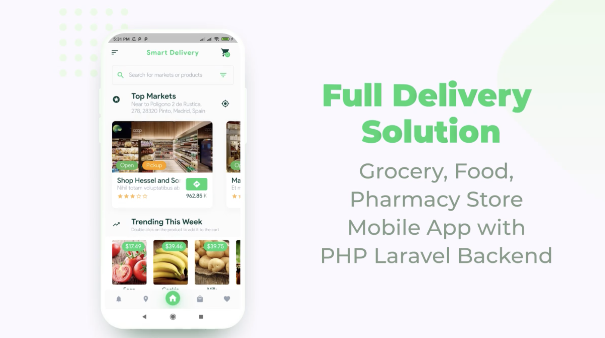
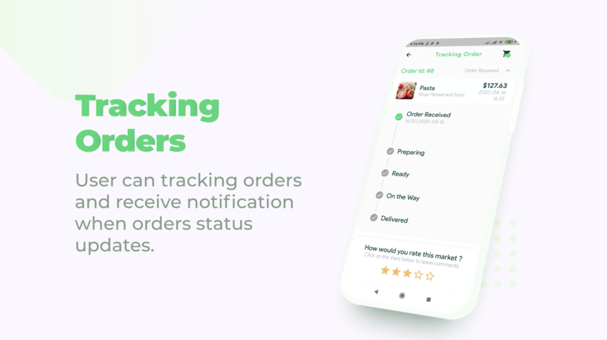
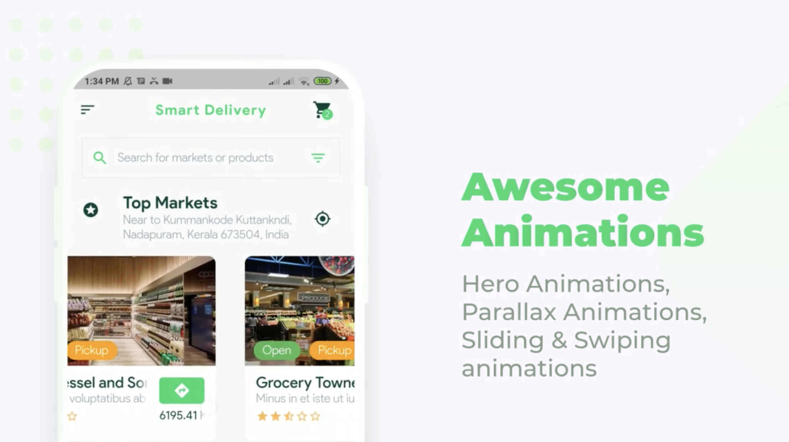
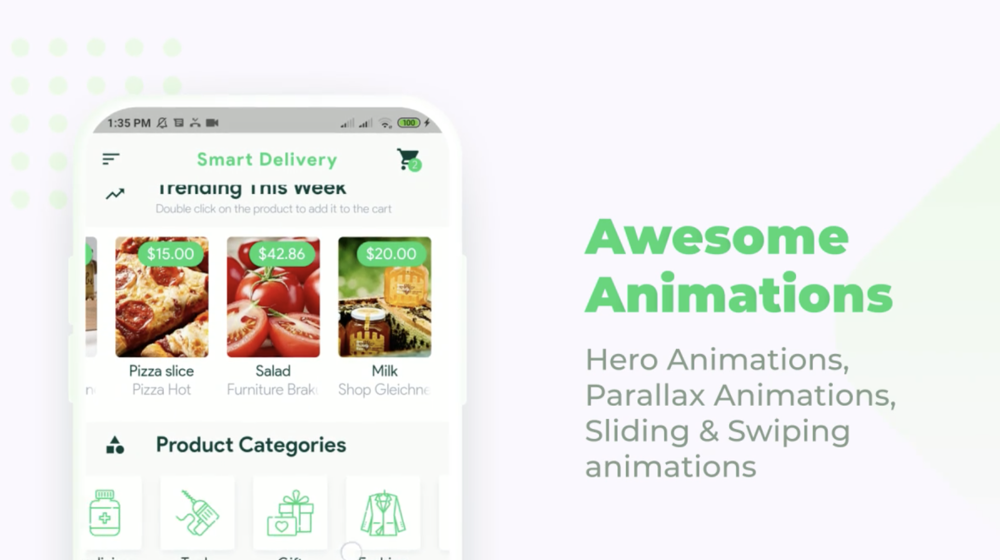
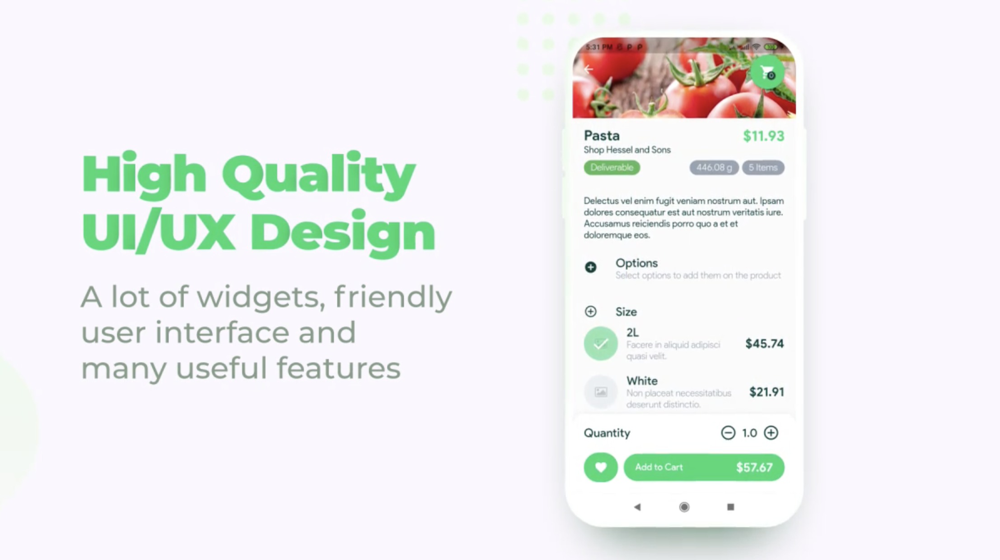
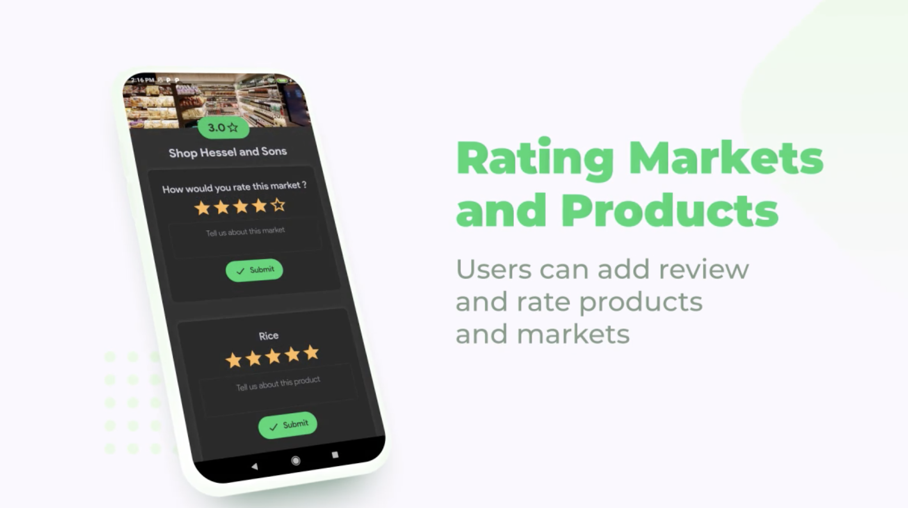

# Multi_vendor_app_with_admin
multi vendor flutter app with php admin panel
[Application_with_Laravel_admin]

# Flutter application
- [✓] Flutter (Channel stable, 3.7.0, on macOS 13.4.1 22F82 darwin-x64, locale en-EG)
# Php Laravel
- PHP 7.4.33 (cli) (built: Sep  1 2023 04:09:59) ( NTS )

# Full devlivery solutions for 
- Grocery
- Resturant
- Pharmacy
- Stores

# Payments Gateway
- Can add your payment and integrate it
- Payments as Visa,MasterCard or PayPal or other
- Owner coould be recive eaarning on Stripe or Paypal

# Tracking Orders
- User could be track it's order status
- Recive notification when order status changed

# Google Maps Integrations
- Easy and simple integrate with maps
- Follow up your order

# Dark And Light theme
- Dark and  ligth awesome theme
- You can easly choose your theme

# Animations
- App with awesome animations 
- Slides aanimations 
- Pages swapping 
- Cards animations and more ...

# Aawesome,Friendly and Flexabile UI&UX Desgin
- High quality to ui & ux desgin
- Friendly  user interface and widgets
- Many Features to do your actions

# Markets & Products rating with awesome search and filters
- User can rate market or prroduct
- Also can add an review aboout market
- Can easliy search and filter products or markets

# Multi Languages
- Applicaattion with Multi Languages 
- Arabic,English,Germaan and more....

